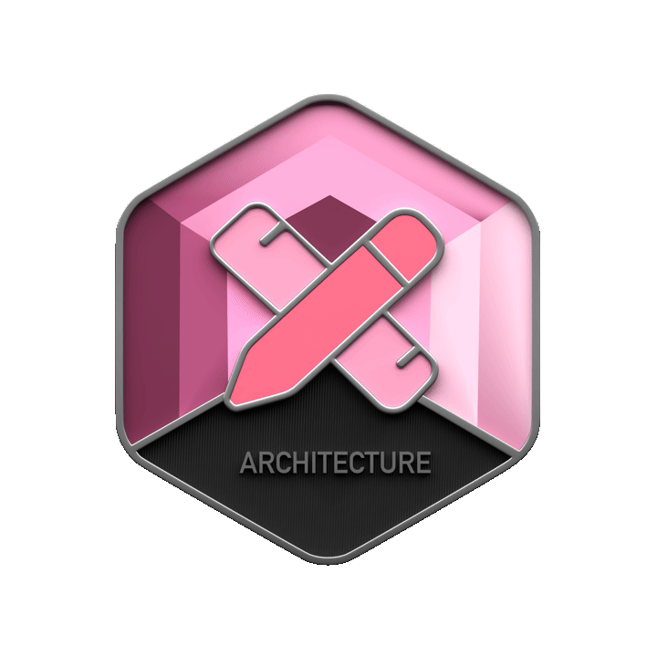
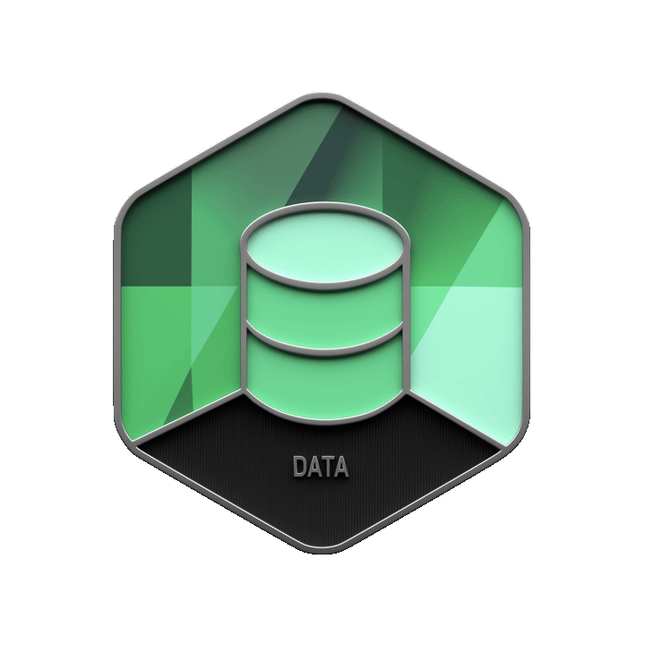
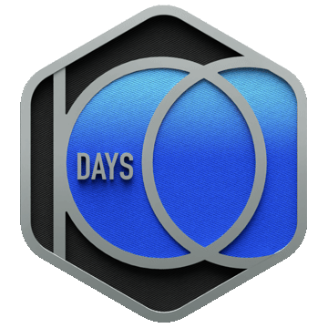
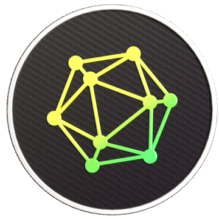
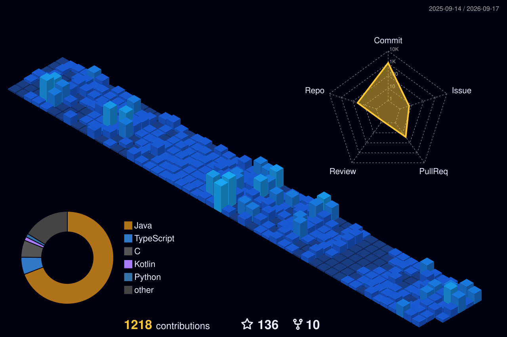

<p align="center">
  
</p>

<p align="center">
  <a href="https://www.linkedin.com/in/abhay-pratap-singh-476624335/">
    
  </a>
  <a href="mailto:pratapsinghabhay0208@gmail.com">
    
  </a>
  <a href="https://leetcode.com/AbhayPratap0208">
    
  </a>
  
</p>

---

# Who Am I

I'm **Abhay Pratap Singh**, a **Bachelor of Technology student in Computer Science**.

A student developer with **conventionally stupid ideas and bigger dreams**.

Curiosity drives me. I enjoy understanding how things work, creating projects, solving problems, and continuously improving my understanding of software engineering.

My current journey revolves around **backend development**, the **Spring ecosystem**, and building a strong foundation in **backend architecture and system design**.

> **Jai Hind**

---

# What I'm Up To

<table>
  <tr>

```
<td width="50%" valign="top">
```

### Currently Deep Diving Into

```yaml
- Spring Ecosystem
- Backend Development
- REST APIs
- Building Projects
- Problem Solving
```

I am currently focused on understanding backend development beyond simply writing code, learning how APIs, services, databases, and application layers work together.

<p>
  
  
  
</p>

```
</td>

<td width="50%" valign="top">
```

### The Long-Term Goal

One day, I hope to:

* Become analytically accurate in everything I build
* Master backend architecture
* Understand complex software systems
* Become strong in system design
* Build software that is well thought out and reliable

<p>
  
  
  
</p>

```
</td>
```

  </tr>
</table>

---
# My Badges

<div align="center">

<table width="100%">
<tr>
<td align="center" width="25%" valign="top">
<a href="https://leetcode.com/medal/?showImg=0&id=10694475&isLevel=false">

</a>
<br><br>
<b>Architecture Builder</b>
</td>

<td align="center" width="25%" valign="top">

<br><br>
<b>Data Badge</b>
</td>

<td align="center" width="25%" valign="top">

<br><br>
<b>100 Days Badge</b>
</td>

<td align="center" width="25%" valign="top">

<br><br>
<b>Dynamic Programming</b>
</td>
</tr>
</table>

</div>

---

# GitHub Achievements

<div align="center">

<table width="100%">
<tr>

<td align="center" width="20%" valign="top">

<br><br>
<b>Pull Shark</b>
</td>

<td align="center" width="20%" valign="top">

<br><br>
<b>Pair Extraordinaire</b>
</td>

<td align="center" width="20%" valign="top">

<br><br>
<b>Quickdraw</b>
</td>

<td align="center" width="20%" valign="top">

<br><br>
<b>Starstruck</b>
</td>

<td align="center" width="20%" valign="top">

<br><br>
<b>YOLO</b>
</td>

</tr>
</table>

</div>

---

# Tech & Interests

<p align="center">


<br/>

<sub>Backend & Development</sub>

</p>

<p align="center">


<br/>

<sub>Development Environment</sub>

</p>

<p align="center">


</p>

---

# GitHub Metrics

<div align="center">


<br><br>



</div>

---

# Problem Solving

I enjoy solving programming problems and exploring the logic behind different approaches.

My focus is not only on getting the correct answer, but understanding:

* How an algorithm works internally
* Why a solution works
* Time and space complexity
* Better approaches to the same problem
* Patterns that can be reused across problems

<p align="center">

<a href="https://leetcode.com/AbhayPratap0208">

</a>

</p>

---

# Development Environment

By the way, I use **Arch Linux**.

<p align="center">

<a href="https://archlinux.org/">

</a>

</p>

---

# Let's Connect

<p align="center">

<a href="https://www.linkedin.com/in/abhay-pratap-singh-476624335/">

</a>

<a href="https://instagram.com/capto.82">

</a>

<a href="https://leetcode.com/AbhayPratap0208">

</a>

<a href="mailto:pratapsinghabhay0208@gmail.com">

</a>

</p>

---

<div align="center">

### Conventionally stupid ideas. Bigger dreams. Always learning.

**Thanks for visiting my profile.**

</div>


